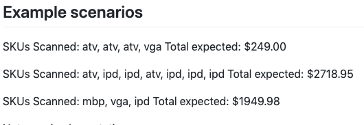

#### Overview

The application is divided into two modules:
1. checkout : Consists of business logic to checkout items.
2. rules : Consists of 
   - Different types rules as mentioned in the specification. Any new rule should be added in this module by
           extending PricingRule.java abstract class. Currently there are 3 rules as mentioned in the specification.
   - RulesEngine to add and get pricing rules.  
   

#### Rules engine

* Types of rules: 
  
        - BulkDealRule : Eg: if you buy 3 Apple TVs, you will pay the price of 2 only.
  
        - BulkDiscountRule : Ipad costing 599.99 drops down to 499.99 each if 5 or more ipads are bought.
  
        - BundleRule : A VGA adapter free of charge is bundled with every MacBook Pro.

* Creating new rules 
  
        - new BulkDealRule(sku:"atv",thresholdQuantity:3,freeItem:1); 
  
        - new BulkDiscountRule(sku:"ipd",dropItemPrice:499.99,thresholdQuntity:4);

        - new BundleRule(sku:"mbp"); bundleRule.setBundledItemsSkus(Collections.singletonList("vga"));
         

* Adding rules to the RulesEngine
  
        - rulesEngine.addRule(bulkDealRule);
  
        - rulesEngine.addRule(bulkDiscountRule);
  
        - rulesEngine.addRule(bundleRule);

#### Checkout module 

Injecting rules to checkout service

    - CheckoutService checkoutService = new CheckoutServiceImpl(rulesEngine.getPricingRules());

Scanning Items 

    - checkoutService.scan(new Item("atv", 109.50));

Totaling Items 

    - double total = checkoutService.total();

#### Test cases

1. Test cases for example scenarios as mentioned below:

can be found at `test/java/com.shoppingcart.checkout.service.CheckoutServiceTest.java`

2. Test cases to test each type of rule can be found at 
   * `test/java/com.shoppingcart.rules.service.BulkDealRuleTest.java`
   * `test/java/com.shoppingcart.rules.service.BulkDiscountRuleTest.java`
   * `test/java/com.shoppingcart.rules.service.BundleRuleTest.java`

This application has been built using gradle and IntellijIdea. Test cases have been implemented using junit5.
